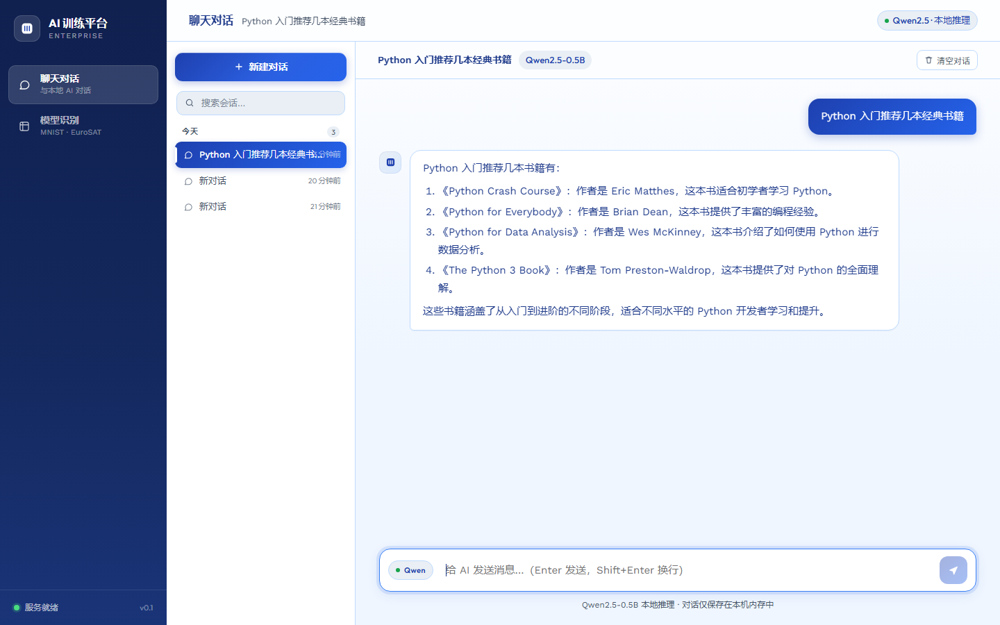
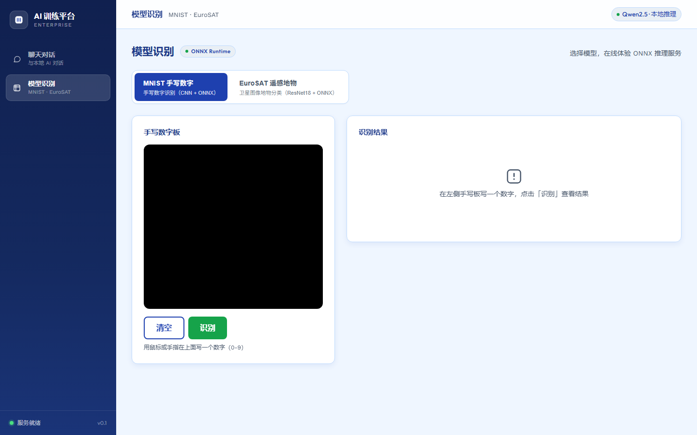

# AI 模型训练研究 — PyTorch

> 技术栈：**PyTorch** + **ONNX**（onnxruntime 推理）+ **Vue 3**（统一门户前端）
> 工作区按「模块化」组织：每个模型一个独立项目模块，数据集统一存放，通用工具独立成目录。

## 📸 界面预览

统一门户（单端口 6660）：聊天对话 + 模型识别（MNIST / EuroSAT 一键切换），前端按 UI UX Pro Max 设计系统实现。

<p align="center">
  
  <br><em>聊天对话（主界面）· 本地 Qwen2.5-0.5B · SSE 流式 · 多会话管理</em>
</p>

<p align="center">
  
  <br><em>模型识别 · MNIST 手写板 / EuroSAT 上传分类切换模块</em>
</p>

## 目录结构

```
AI模型训练_PyTorch/
├── projects/            # ★ 模型项目模块（每个模型一个目录，互不干扰）
│   ├── mnist/           #   MNIST 手写数字识别（入门 CNN + ONNX 部署全流程）
│   │   ├── model.py        模型结构（唯一来源）
│   │   ├── train.py        训练 → models/mnist_cnn.pth
│   │   ├── predict.py      PyTorch 推理（测试集/自己的图片）
│   │   ├── export_onnx.py  导出 ONNX → models/mnist_cnn.onnx
│   │   ├── onnx_predict.py onnxruntime 推理（验证导出结果）
│   │   ├── models/         权重与 ONNX 模型
│   │   └── deploy/         交付包（自包含：网页+服务+exe，可直接打包发给别人）
│   ├── fashion/         #   FashionMNIST 衣物分类（迁移学习实验）
│   │   ├── transfer_learning.py      MNIST→FashionMNIST 迁移对比实验
│   │   ├── imagenet_inference.py     ImageNet 预训练 ResNet18 推理体验
│   │   ├── resnet_transfer_template.py  新数据集迁移学习模板
│   │   └── models/         fashion_cnn_transferred.pth
│   └── eurosat/         #   EuroSAT 遥感图像分类（企业级迁移学习 + ONNX 服务）
│       ├── train.py         训练 → models/eurosat_resnet18.pth
│       ├── export.py        导出 ONNX → models/eurosat_resnet18.onnx
│       ├── serve.py         HTTP 推理服务（端口 8001，网页 demo.html）
│       ├── e2e_test.py      端到端测试（真实测试图 → 服务 → 结果）
│       └── models/          eurosat_resnet18.pth / .onnx
│   └── chat/            #   语言对话（本地 Qwen2.5-0.5B，持续对话界面）
│       ├── model.py         模型加载唯一入口（权重缓存到 models/）
│       ├── chat.py          对话引擎（多轮历史 + 流式生成）
│       ├── app.py           Gradio 持续对话界面（端口 7860，流式输出）
│       ├── test_chat.py     命令行冒烟测试
│       └── models/          HuggingFace 权重缓存（约 1GB，gitignore）
├── datasets/            # ★ 所有数据集（torchvision 直接识别）
│   ├── mnist/               MNIST（含 MNIST/raw）
│   ├── fashion/             FashionMNIST
│   └── eurosat/             EuroSAT（2750/ 全量图、subset/ 训练子集、划分 txt、zip）
├── shared/              # ★ 通用工具（不依赖具体模型）
│   ├── check_env.py        环境检查（PyTorch/CUDA/GPU）
│   ├── inspect_image.py    图片诊断（为什么模型认错你的图）
│   └── parse_raw.py        解析 MNIST raw 二进制格式
├── docs/                # 文档与图表
│   ├── 学习笔记.md
│   └── diagrams/            ml_flow* 架构图（archify 生成）
├── frontend/            # ★ Vue 3 前端（所有页面的统一实现地，见下方「前端开发规范」）
│   ├── src/                 views/ 页面、components/ 组件、styles/ 设计令牌
│   └── design-system 引用   design-system/ai-training-platform/MASTER.md
├── design-system/       # ★ UI/UX 设计系统（UI UX Pro Max skill 生成）
│   └── ai-training-platform/
│       ├── MASTER.md           全局设计规范（颜色/字体/间距/组件，唯一事实来源）
│       └── pages/              页面级覆盖（可选，优先级高于 MASTER）
├── skills/              # ★ 第三方 skill 源码
│   └── ui-ux-pro-max-skill/    UI UX Pro Max 设计智能 skill（含 search.py 搜索引擎）
├── README.md            本文件
└── requirements.txt     依赖清单（torch / torchvision；推理另需 onnxruntime pillow）
```

## 快速开始

```bash
# 环境检查
python shared/check_env.py

# MNIST 全流程
python projects/mnist/train.py          # 训练
python projects/mnist/predict.py        # 推理
python projects/mnist/export_onnx.py    # 导出 ONNX
python projects/mnist/onnx_predict.py   # onnxruntime 验证

# 交付服务（浏览器打开 http://localhost:8000）
python projects/mnist/deploy/serve.py
#   免安装版: projects/mnist/deploy/dist/MNIST识别服务.exe

# EuroSAT 服务（浏览器打开 http://localhost:8001）
python projects/eurosat/serve.py
python projects/eurosat/e2e_test.py     # 端到端测试（需服务已启动）

# 语言对话（首次运行自动下载模型约 1GB）
pip install transformers gradio
python projects/chat/test_chat.py "你好"   # 命令行冒烟测试
python projects/chat/app.py                # 持续对话界面 http://localhost:7860
#   国内网络下载慢时先设置镜像: $env:HF_ENDPOINT = "https://hf-mirror.com"
```

> 所有脚本的路径都基于脚本自身位置解析（`__file__`），**在哪个目录下运行都行**，不依赖工作目录。

## 约定：以后新增模型怎么加？

1. **数据集**：放入 `datasets/<数据集名>/`（torchvision 数据集保持原有子目录结构）
2. **项目模块**：新建 `projects/<模型名>/`，按需添加：
   - `train.py` — 训练，权重存到 `models/`
   - `export.py` / `export_onnx.py` — 导出 ONNX
   - `serve.py` — HTTP 服务（可仿照 `mnist/deploy` 或 `eurosat`）
   - `models/` — 权重与 ONNX 模型
3. **通用工具**：放 `shared/`，与具体模型无关的代码不要写进项目模块
4. 参考模板：小模型迁移学习看 `fashion/resnet_transfer_template.py`，完整服务闭环看 `eurosat/`

## ONNX 说明

训练产物 `.pth` 只有 PyTorch 能读；`export_onnx.py` 把它导出为 `.onnx`（结构+权重一体），对方只需 `pip install onnxruntime` 即可在任意语言/平台推理，不需要 PyTorch。详见各模块的 export 脚本注释与 `projects/mnist/deploy/使用说明.md`。

## 版本库说明（Git）

仓库只包含**代码与文档**，大体积/可再生的内容不入库（见 `.gitignore`）：

| 内容 | 说明 | 获取方式 |
|---|---|---|
| `datasets/` | 数据集（约 327MB） | torchvision 首次运行自动下载 |
| 模型权重 `*.pth` / `*.onnx` | 训练产物 | 运行各项目 `train.py` / `export*.py` 重建 |
| Qwen 对话模型（约 1GB） | HuggingFace 权重 | 运行 `projects/chat/test_chat.py` 自动下载 |
| `skills/` | UI UX Pro Max skill（第三方 MIT 开源） | https://github.com/nextlevelbuilder/ui-ux-pro-max-skill |
| `frontend/` 构建产物 | node_modules / dist / .npm-cache | `cd frontend && npm install && npm run build` |

> 前端源码（Vue 3）随本仓库一并管理（`frontend/`），原独立仓库 AI-demo 保留历史版本。

## 前端开发规范（Vue 3 + UI UX Pro Max skill）

> 所有页面一律用 **Vue 3** 在 `frontend/` 下实现，视觉与交互按 **UI UX Pro Max** skill 生成的设计系统执行。

### 🚀 统一门户（推荐入口，单端口 6660）

所有功能整合在一个服务里，浏览器打开 **http://localhost:6660**：

```bash
python projects/portal/app.py
```

| 功能 | 入口 | 说明 |
|---|---|---|
| 聊天对话（主界面） | 侧边栏「聊天对话」 | 本地 Qwen2.5-0.5B，SSE 流式、多会话、Markdown 渲染 |
| 模型识别（切换模块） | 侧边栏「模型识别」 | MNIST 手写板 / EuroSAT 上传，Tab 一键切换 |
| 推理 API | `/api/mnist/predict`、`/api/eurosat/predict` | ONNX 推理（json） |
| 聊天 API | `/api/chat/new`、`/api/chat/send`(SSE)、`/api/chat/list`、`/api/chat/history`、`/api/chat/delete` | 会话管理 + 流式 |
| 状态查询 | `/api/status` | 聊天模型加载状态 |

- 聊天模型（Qwen2.5-0.5B，约 1GB）启动时**后台预加载**，加载完成前聊天接口返回 503，前端自动提示
- 前端构建产物：`cd frontend && npm run build`（产物被门户自动托管，改前端后重新 build 即可）
- 旧入口已退役：MNIST 8000 / EuroSAT 8001 的独立页面已删除并合并进门户；chat 的 Gradio 界面（7860）保留但不再是主入口

### 设计规范（唯一事实来源）

- **全局规范**：`design-system/ai-training-platform/MASTER.md` — 颜色 / 字体 / 间距 / 阴影 / 组件规范 / 反模式 / 交付检查清单
- **页面级覆盖**：`design-system/ai-training-platform/pages/<page>.md`（存在时优先于 MASTER）
- **前端令牌**：已从 MASTER 提取到 `frontend/src/styles/tokens.css`（`--color-*`、`--space-*`、`--shadow-*`），组件样式见 `base.css`
- 修改设计时：先重新生成 MASTER（见下），再同步 tokens.css，不要手改散落的色值

### 页面开发工作流

1. **出设计系统**（新页面/新项目时）：用 skill 的搜索引擎生成并持久化设计规范：
   ```bash
   python skills/ui-ux-pro-max-skill/.claude/skills/ui-ux-pro-max/scripts/search.py \
     "<产品类型 行业 关键词>" --design-system --persist -p "AI Training Platform" \
     --output-dir design-system --page "<page-name>"
   ```
   （Windows 下用 `python`；页面已存在时加 `--force` 需人工确认）
2. **检索规则**：开发某页面时先读 MASTER.md；若 `pages/<page>.md` 存在则以其覆盖 MASTER
3. **按需补充查询**（颜色/字体/风格/UX 细则等）：
   ```bash
   python skills/ui-ux-pro-max-skill/.claude/skills/ui-ux-pro-max/scripts/search.py \
     "<关键词>" --domain style|color|typography|ux|chart|icons|landing
   python skills/ui-ux-pro-max-skill/.claude/skills/ui-ux-pro-max/scripts/search.py \
     "<关键词>" --stack vue
   ```
4. **实现**：在 `frontend/src/views/` 建页面、`frontend/src/components/` 建组件，一律使用 tokens.css 中的设计令牌与 base.css 组件类
5. **交付前检查**：对照 MASTER.md 的 Pre-Delivery Checklist（无 emoji 图标、cursor-pointer、4.5:1 对比度、可见焦点、prefers-reduced-motion、375/768/1024/1440 响应式）

### Vue 3 工程（frontend/）

- 技术栈：Vue 3.5 + Vite + vue-router + Pinia（hash 模式，产物由门户服务托管）
- 构建：`cd frontend && npm run build`（产物输出到 `frontend/dist/`，门户自动托管，重新 build 后刷新浏览器即生效）
- `npm run dev`（5174）仅作开发调试用，日常访问请走 6660 门户
- 依赖与 npm 镜像配置见 `frontend/.npmrc`（registry=npmmirror，cache 在工作区内）
- 注意：在 DSH 会话沙箱内 `npm run dev` 会被 spawn 限制拦截，请在自己的终端运行

### 前端与模型服务的对接方式（2026-08 统一架构）

所有页面与模型服务已整合进**单端口门户**（`projects/portal/app.py`，6660），
旧的独立 HTML 页面（mnist index.html、eurosat demo.html、chat 样式等）已删除
（备份在系统临时目录），`mnist/deploy/serve.py`、`eurosat/serve.py` 保留但不再是主入口：

```
浏览器 ──> http://localhost:6660/           (门户托管 Vue 前端)
         ├── POST /api/chat/send           (聊天 SSE 流式)
         ├── POST /api/mnist/predict       (MNIST 推理)
         └── POST /api/eurosat/predict     (EuroSAT 推理)
```

- 修改前端后：`cd frontend && npm run build`，刷新浏览器即生效（无需重启服务）
- 未构建前端时服务会打印提示，不会报错

### skill 源码

- 位置：`skills/ui-ux-pro-max-skill/`（MIT 开源，git 克隆）
- 搜索引擎：`.claude/skills/ui-ux-pro-max/scripts/search.py`（Python 3 标准库，无需安装依赖）
- 内置 79 种 UI 风格、192 套配色、74 组字体搭配、119 条 UX 准则、22 个技术栈指南（含 vue）

## 已安装的 DSH 插件：工作区文件浏览

- **功能**：对话右侧并排 Cursor 风格文件面板（目录树 + 文件标签页 + 代码高亮预览），自动识别当前会话工作区
- **安装方式**：独立 DSH 插件包（`dsh-workspace-browser`），已通过 pnpm 安装到 desktop profile（`~/.dsh/profiles/desktop`），并在 `dsh.profile.bundles` 注册，随 DSH Desktop 启动自动加载
- **源码位置**：`C:\Users\cc\.dsh\plugins\workspace-browser\`（改代码后重新执行 pnpm add 安装）
  - `cordis.patch.yml` — Host 组合补丁（注册插件）
  - `lib/host.js` — Host 插件（`/api/workspace-browser/*` 路由，走 DSH fs 服务，限定工作区内）
  - `lib/client.js` — Client 插件（web bundle，注册 details 右侧列）
- **卸载**：`pnpm --dir ~/.dsh/profiles/desktop remove dsh-workspace-browser`，并从 `package.json` 的 `dsh.profile.bundles` 移除后重启
- **管理**：可在 DSH 插件管理界面（Plugins 设置页）查看/禁用
